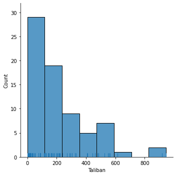

# Homework downloads

## Homework 0

- [Download Homework 0 Notebook](./homework-0/hw-00.ipynb)
- [Download Homework 0 PDF](./homework-0/hw-00.pdf)

## Assignment 2

- [Download Assignment 2 Notebook](./assignment2/Assignment2.ipynb)
- [Download Assignment 2 PDF](./assignment2/Assignment2.pdf)

**Q3a Histogram of Taliban Casualties:**

This histogram shows shows the distribution of Taliban casualties across different casualty ranges, indicating how frequently each range of casualties occurred.

**Q3b Kernel Density Plot of Civilian Casualties:**

The KDE plot shows the probability distribution of civilian casualties, indicating where the values are most common and the likelihood of different casualty numbers occurring.

**Q3c Vertical Bar Chart of Casualties per Month:**

This bar chart shows total casualties (sum of Taliban, Afghan forces, NATO forces, and civilians) for each month across multiple years.

**Q3c Horizontal Bar Chart of Casualties per Month:** 

A horizontal bar chart is easier to read as it allows better visibility of the categorical month labels, it also shows the total casualities for each month across multiple years.

**Q5c Line Graph of Afghan and Civilian Casualties Over Time:**

This line graph visualizes the total casualties for Afghan forces and civilians for every month, showing how the number of casualties varied from month to month over the years. 

**Q5c Vertical Bar Graph of Afghan and Civilian Casualties Over Time:**

The bar graph shows the total casualties for Afghan forces and civilians for every month.

